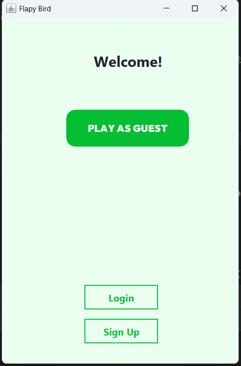
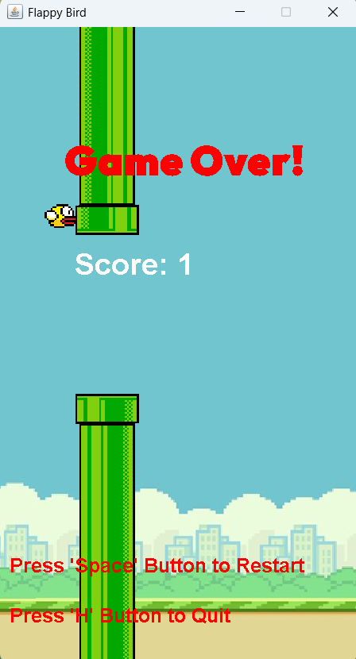
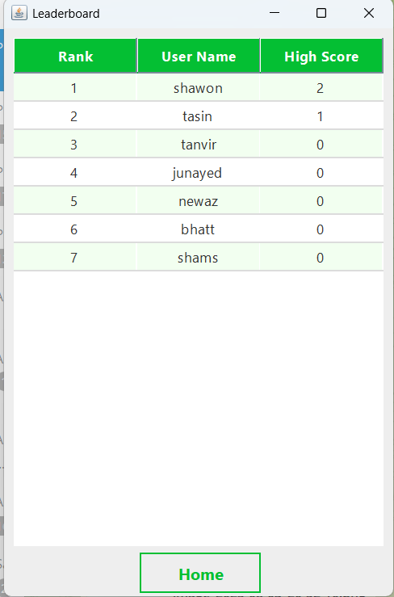

# Flappy Bird Clone in Java with Database Integration

A **Flappy Bird** clone written in **Java** with a **database** to store **user accounts (ID + password)** and **high scores**.  
Players can register/login, play, and compete for the best score.

---

## ✨ Features
- 🐤 Classic Flappy Bird gameplay (jump through pipes, avoid collisions).
- 👤 **User accounts**: register & login.
- 🏆 **High score tracking** stored in the database per user.
- 💾 Simple, portable DB layer (works with **SQLite** or **MySQL**).
- 🔄 New game / restart flow.

---

## 🧰 Tech Stack
- **Java 17+** (works with any standard JDK).
- **Swing** (lightweight desktop GUI).
- **SQLite** (default) or **MySQL** for persistence.
- **JDBC** for database access.

---

## 🕹 Usage
- Launch the app and **Register** or **Login**.
- Press **Spacebar** to flap the bird and avoid pipes.
- When you set a new record, the **high score** is saved to the database.

---

## 📸 Screenshots
- Homepage  
  
- Login / Registration  
  
- Game Over  
  
- High Score  
  

---

## 👤 Authors
- [Md. Tasin Absar](https://github.com/WorldlySage03/)
- [Shahid Mohammed Rokon Uddin (Shawon)](https://github.com/Firewafer)
